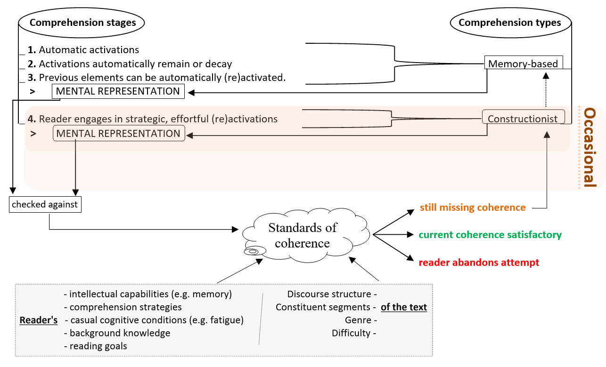

Throughout the 1990s, two opposing theories were used to explain how people understand texts, later bridged by the Landscape Model of reading (van den Broek, Young, Tzeng, & Linderholm, 1999). A review is offered below, including a schematic representation of the Landscape Model. 

## Memory-based view 

The memory-based view presented reading as an autonomous, unconscious, effortless process. Readers were purported to achieve an understanding of a text as a whole by combining the concepts, and implications readily afforded, in the text with their own background knowledge (Myers & O’Brien, 1998; O’Brien & Myers, 1999). This memory-based view did not include a conscious (re)activation of meaning. Arguably, this absence raises the question of how readers could recover the meaning if ever distracted while reading.  

## Constructionist view 

The constructionist view contended that readers make strategic, time-consuming efforts to access prior text and background knowledge (Graesser, Singer, & Trabasso, 1994; Singer, Graesser, & Trabasso, 1994). A possible challenge for this view is in leisure reading. If reading is effortful, how could it be explained when people become absorbed in leisure reading for hours, and enjoy it? How could this activity become as automatic and fast as it often does? 

## Landscape Model 

The memory-based and the constructionist views were bridged in a proposal called the Landscape Model (van den Broek et al., 1999). With a step-based model, van den Broek et al. argued that strategic (re)activations are available to the reader, but need not always be used (see also Converse, 2018). Figure 1 illustrates the dynamic, often cyclical processes.

</img>

Figure 1. Mindmap of van den Broek et al.’s Landscape Model of reading comprehension. Created by Pablo Bernabeu and retrieved from https://doi.org/10.6084/m9.figshare.1591215.

The Landscape Model was applied to the context of discourse analysis by Yeari and van den Broek (2011). The authors noted that discourse analysts may find it useful to adopt a top-down, inductive approach to their task. That is, suppressing the natural, incremental route of meaning making in reading, discourse analysts may want to read through the text to gain a general idea first, before tackling a detailed analysis (see also Bell, 2011). 

## References 

Bell, A. (2011). Re-constructing Babel: Discourse analysis, hermeneutics and the Interpretive Arc. *Discourse Studies, 13*(5), 519–568. https://doi.org/10.1177/1461445611412699. 

Converse, N. E. (2018). The Use of Explicit Comprehension Strategies During Oral Instruction of Informational Text Structures and the Effect on First-graders' Listening Comprehension (Doctoral dissertation). Retrieved from https://digitalcommons.usu.edu/etd/7305. 

Graesser, A., Singer, M., & Trabasso, T. (1994). Constructing inferences during narrative comprehension. *Psychological Review, 101*(3), 371–395. https://doi.org/10.1037/0033-295X.101.3.371. 

Myers, J. L., & O’Brien, E. J. (1998). Accessing the discourse representation during reading. *Discourse Processes, 26*(2-3), 131–157. https://doi.org/10.1080/01638539809545042. 

O’Brien, E. J., & Myers, J. L. (1999). Text comprehension: A view from the bottom up. In S. R. Goldman, A. C. Graesser & P. van den Broek P (Eds.), *Narrative Comprehension, Causality, and Coherence: Essays in Honor of Tom Trabasso* (pp. 35-53). Mahwah, NJ: Lawrence Erlbaum Associates. 

Singer, M., Graesser, A. C., & Trabasso, T. (1994). Minimal or global inference during reading. *Journal of Memory and Language, 33*(4), 421–441. https://doi.org/10.1006/jmla.1994.1020. 

van den Broek, P., Young, M., Tzeng, Y., & Linderholm, T. (1999). The landscape model of reading. In H. van Oostendorp & S. R. Goldman (Eds.), *The construction of mental representations during reading* (pp. 71-98). Mahwah, NJ: Erlbaum.

Yeari, M., & van den Broek, P. (2011). A cognitive account of discourse understanding and discourse interpretation: The Landscape Model of reading. *Discourse Studies, 13*(5), 635-643. https://doi.org/10.1177/1461445611412748. 

