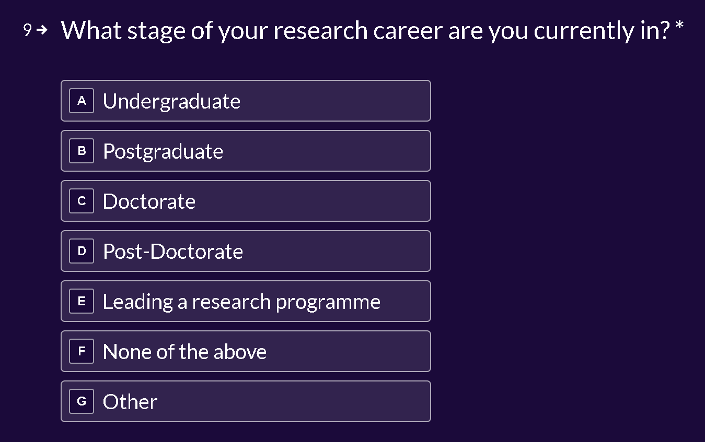
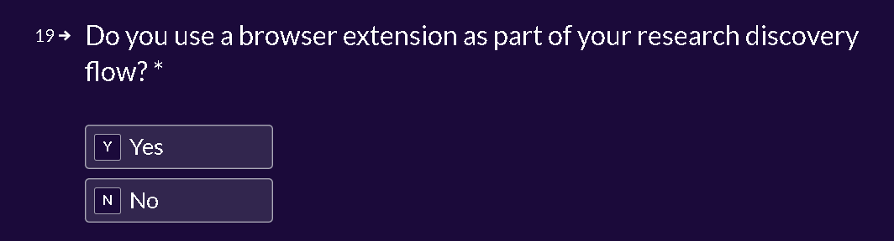

I recommend caution when receiving an invitation from Polar Insight (also dubbed 'Polar Intelligence') to complete a survey. When I received one, it ended up in a deceptive change of the terms. The deception emerged after two emails exchanged with the company's managing director, James Tattersfield, and an employee. 

The case began when the managing director invited me to complete two tasks in exchange for a $125 USD voucher. The two tasks were a survey ('short form', in the director's words) and an hour-long interview. Below is the email:

<blockquote>

From: James Tattersfield <james@polarintelligence.com>

Sent: Thursday, January 27, 2022 12:33:32 PM

To: De Juan Bernabeu, Pablo <p.bernabeu@lancaster.ac.uk>

Subject: [External] Research Interview Request

This email originated outside the University. Check before clicking links or attachments.

Hi Pablo,

I'm emailing you to discuss your participation in a global research study that my organisation (Polar Insight, a research firm based in London) is conducting to better understand how academic researchers are discovering and accessing scholarly articles outside university campus.

At this point in the project, we are particularly interested in hearing from those who have completed - or are currently completing - a PhD or post-doctorate degree.

My research team has identified you as a potential respondent and asked me to reach out to see whether you may be interested in taking part in one of our online, paid research interviews in February. Does this sound like something you would be interested in?

Details:

Format: Online Video Interview

Time required: 60 minutes

When: February 2022

Prep. required: None

Reward for taking part: $125 USD (via our gifting partner, Tremendous)

Next steps: 

1) If you'd like to take part, please reconfirm your suitability using this short form: <a href='https://polarinsight.typeform.com/res-dis' rel='nofollow'>https://polarinsight.typeform.com/res-dis</a>

2) Once we receive your answers, myself or a member of the team will be in contact to get you scheduled in.

3) After the interview is completed, we'll be in touch to process your reward.

If you have any questions, please do feel free to reply to this email and I'll do my best to answer them.

Thanks,

James

\-\-

James Tattersfield

Managing Director

UK - 68 Hanbury St, London, E1 5JL, United Kingdom

Registered in England and Wales as a Private Limited Company.

'Polar Insight' is a registered trademark owned by Polar Insight Limited.

Company number: 10587770 VAT: GB 279 4939 34

If you no longer want to receive emails regarding our research projects, you are welcome to unsubscribe from any future communications here

</blockquote>

 

Following this invitation, I---and presumably many other researchers---responded to a survey (see some screenshots below) that  provided the company with data that might be used for business purposes.

</img>
</img>
</img>
</img>
</img>
</img>
</img>
</img>
</img>

 
Once the company had received my survey completed, an employee wrote back to change the original terms, on the grounds that 'we have had a high volume of responses to our survey, so unfortunately, not everyone will be selected on this occasion'. Such a change of the terms was unethical, as it happened after I had accepted the invitation from the company under the original terms. Crucially, if the company had truthfully specified the terms in the first email, they would not have received back anywhere as many surveys completed. Ethics is important in the distribution of surveys, even in business. It is noteworthy that Polar Insight boasts a portfolio of clients on its website that covers a range of private sectors as well as public bodies. It is, therefore, striking that this company decided to scam a PhD student.

I emailed the company and the CEO James Tattersfield to request my reward. After they had ignored my emails, and then replied with evasive responses, I contacted the CEO on LinkedIn. Again, he yielded evasive responses only. 

The present case incidentally demonstrates that the role of ethics committees---tasked with assessing surveys, among other things---goes beyond gross themes. Economic deception is one of the negligent acts that must be prevented. 

Similar survey scams have been documented:

- https://moneydoneright.com/fast-money/online-work/surveys/surveys-for-money

- https://www.accc.gov.au/media-release/watch-out-for-scam-surveys-and-fake-gift-card-offers

- https://www.facebook.com/dollargeneral/posts/pfbid032BmUQrAUh7p9yuw8eQKavZZrUC7zsGeBiT2E4efDEASCFSsem7vLKNiipgWNqYjpl

 

