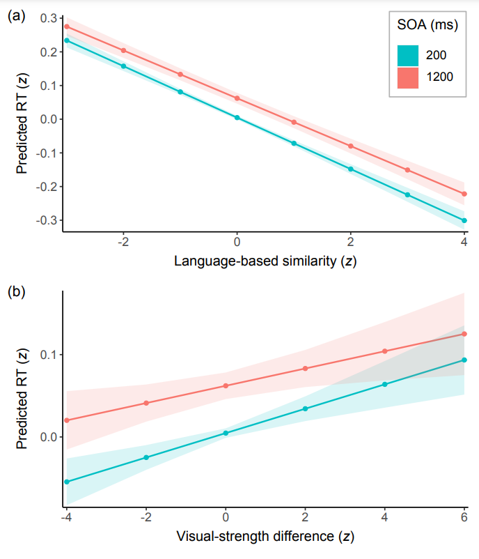

```{r setup, include = FALSE}

# Basic knitr options
knitr::opts_chunk$set(message = FALSE, warning = FALSE, error = FALSE, 
                      echo = TRUE, fig.align = 'center')

```


Whereas the direction of main effects can be interpreted from the sign of the estimate, the interpretation of interaction effects often requires plots. This task is facilitated by the R package [`sjPlot`](https://cran.r-project.org/web/packages/sjPlot/sjPlot.pdf) (Lüdecke, 2022). In Bernabeu (2022), the sjPlot function called `plot_model` served as the basis for the creation of some [custom functions](https://github.com/pablobernabeu/language-sensorimotor-simulation-PhD-thesis/tree/main/R_functions). One of these functions is [`alias_interaction_plot`](https://github.com/pablobernabeu/language-sensorimotor-simulation-PhD-thesis/blob/main/R_functions/alias_interaction_plot.R), which allows the plotting of interactions between a continuous variable and a categorical variable. Importantly, the categorical variable is replaced with an alias variable. This feature allows the back-transformation of the categorical variable to facilitate the communication of the results, for instance, when the categorical variable was sum-coded, which has been recommended for mixed-effects models (Brauer & Curtin, 2018).

Below, we'll use the function with a model fitted using [`lmerTest`](https://cran.r-project.org/web/packages/lmerTest/lmerTest.pdf) (Kuznetsova et al., 2022), although the function also works with several other models (see [sjPlot manual](https://cran.r-project.org/web/packages/sjPlot/sjPlot.pdf)). The plot can be reproduced using the materials at https://osf.io/gt5uf.


## Alias interaction plot

### The function

<script src="https://emgithub.com/embed-v2.js?target=https%3A%2F%2Fgithub.com%2Fpablobernabeu%2Flanguage-sensorimotor-simulation-PhD-thesis%2Fblob%2Fmain%2FR_functions%2Falias_interaction_plot.R&style=a11y-dark&type=code&showBorder=on&showLineNumbers=on&showFileMeta=on&showFullPath=on&showCopy=on"></script>

### The function in use

<script src="https://emgithub.com/embed-v2.js?target=https%3A%2F%2Fgithub.com%2Fpablobernabeu%2Flanguage-sensorimotor-simulation-PhD-thesis%2Fblob%2Fmain%2Fsemanticpriming%2Ffrequentist_analysis%2Fsemanticpriming-interactions-with-SOA.R&style=a11y-dark&type=code&showBorder=on&showLineNumbers=on&showFileMeta=on&showFullPath=on&showCopy=on"></script>

[{width=550px}](https://github.com/pablobernabeu/language-sensorimotor-simulation-PhD-thesis/blob/main/semanticpriming/frequentist_analysis/plots/semanticpriming-interactions-with-SOA.pdf)


### References

Bernabeu, P. (2022). *Language and sensorimotor simulation in conceptual processing: Multilevel analysis and statistical power*. Lancaster University. https://doi.org/10.17635/lancaster/thesis/1795

Brauer, M., & Curtin, J. J. (2018). Linear mixed-effects models and the analysis of nonindependent data: A unified framework to analyze categorical and continuous independent variables that vary within-subjects and/or within-items. *Psychological Methods, 23*(3), 389–411. https://doi.org/10.1037/met0000159

Kuznetsova, A., Brockhoff, P. B., & Christensen, R. H. B. (2022). *Package ’lmerTest’*. CRAN. https://cran.r-project.org/web/packages/lmerTest/lmerTest.pdf

Lüdecke, D. (2022). *Package ’sjPlot’*. CRAN. https://cran.r-project.org/web/packages/sjPlot/sjPlot.pdf


