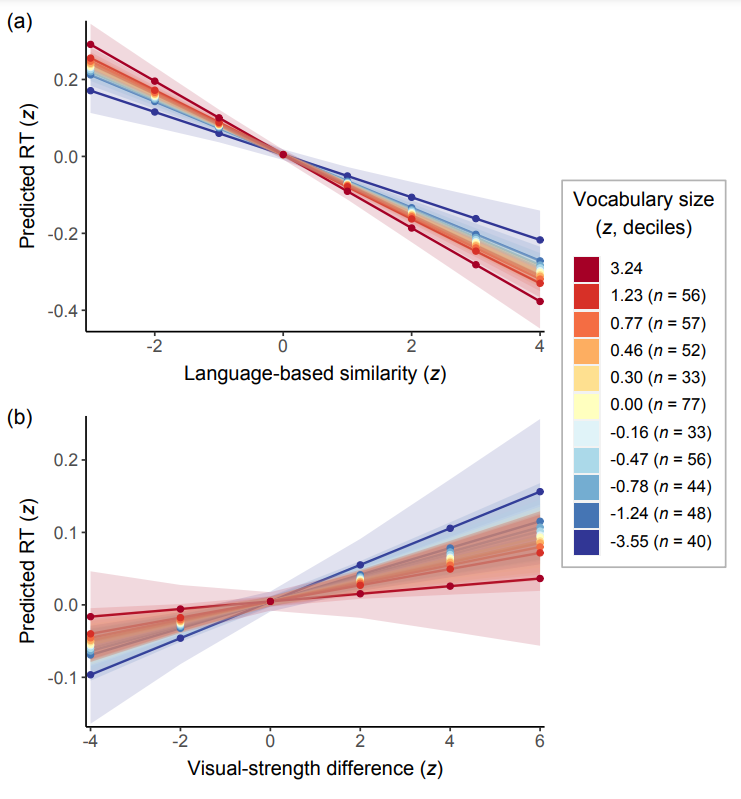
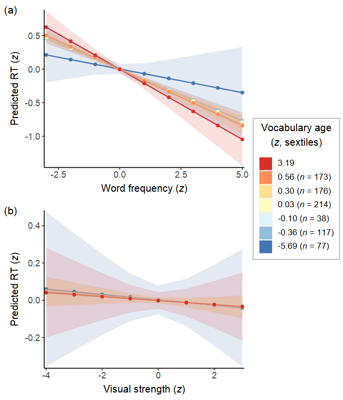

```{r setup, include = FALSE}

# Basic knitr options
knitr::opts_chunk$set(message = FALSE, warning = FALSE, error = FALSE, 
                      echo = TRUE, fig.align = 'center')

```


Whereas the direction of main effects can be interpreted from the sign of the estimate, the interpretation of interaction effects often requires plots. This task is facilitated by the R package [`sjPlot`](https://cran.r-project.org/web/packages/sjPlot/sjPlot.pdf) (Lüdecke, 2022). In Bernabeu (2022), the sjPlot function called `plot_model` served as the basis for the creation of some [custom functions](https://github.com/pablobernabeu/language-sensorimotor-simulation-PhD-thesis/tree/main/R_functions). Two of these functions are [`deciles_interaction_plot`](https://github.com/pablobernabeu/language-sensorimotor-simulation-PhD-thesis/blob/main/R_functions/deciles_interaction_plot.R) and [`sextiles_interaction_plot`](https://github.com/pablobernabeu/language-sensorimotor-simulation-PhD-thesis/blob/main/R_functions/sextiles_interaction_plot.R). These functions allow the plotting of interactions between two continuous variables. In the case of `deciles_interaction_plot`, one of the variables is divided into ten bins, known as deciles, and the other variable is unchanged. In the case of `sextiles_interaction_plot`, one of the variables is divided into six bins, or sextiles, and the other variable is unchanged. Sample size per bin can be printed in the legend, which is particularly useful for research involving individual differences. 

Below, we'll use these functions with models fitted using [`lmerTest`](https://cran.r-project.org/web/packages/lmerTest/lmerTest.pdf) (Kuznetsova et al., 2022), although the functions also work with several other models (see [sjPlot manual](https://cran.r-project.org/web/packages/sjPlot/sjPlot.pdf)). The plots can be reproduced using the materials at https://osf.io/gt5uf.


## Deciles interaction plot

### The function

<script src="https://emgithub.com/embed-v2.js?target=https%3A%2F%2Fgithub.com%2Fpablobernabeu%2Flanguage-sensorimotor-simulation-PhD-thesis%2Fblob%2Fmain%2FR_functions%2Fdeciles_interaction_plot.R&style=a11y-dark&type=code&showBorder=on&showLineNumbers=on&showFileMeta=on&showFullPath=on&showCopy=on"></script>

### The function in use

<script src="https://emgithub.com/embed-v2.js?target=https%3A%2F%2Fgithub.com%2Fpablobernabeu%2Flanguage-sensorimotor-simulation-PhD-thesis%2Fblob%2Fmain%2Fsemanticpriming%2Ffrequentist_analysis%2Fsemanticpriming-interactions-with-vocabulary-size.R&style=a11y-dark&type=code&showBorder=on&showLineNumbers=on&showFileMeta=on&showFullPath=on&showCopy=on"></script>

[{width=580px}](https://github.com/pablobernabeu/language-sensorimotor-simulation-PhD-thesis/blob/main/semanticpriming/frequentist_analysis/plots/semanticpriming-interactions-with-vocabulary-size.pdf)


## Sextiles interaction plot

### The function 

<script src="https://emgithub.com/embed-v2.js?target=https%3A%2F%2Fgithub.com%2Fpablobernabeu%2Flanguage-sensorimotor-simulation-PhD-thesis%2Fblob%2Fmain%2FR_functions%2Fsextiles_interaction_plot.R&style=a11y-dark&type=code&showBorder=on&showLineNumbers=on&showFileMeta=on&showFullPath=on&showCopy=on"></script>

### The function in use

<script src="https://emgithub.com/embed-v2.js?target=https%3A%2F%2Fgithub.com%2Fpablobernabeu%2Flanguage-sensorimotor-simulation-PhD-thesis%2Fblob%2Fmain%2Flexicaldecision%2Ffrequentist_analysis%2Flexicaldecision-interactions-with-vocabulary-age.R&style=a11y-dark&type=code&showBorder=on&showLineNumbers=on&showFileMeta=on&showFullPath=on&showCopy=on"></script>

[{width=650px}](https://github.com/pablobernabeu/language-sensorimotor-simulation-PhD-thesis/blob/main/lexicaldecision/frequentist_analysis/plots/lexicaldecision-interactions-with-vocabulary-age.pdf) 


### References

Bernabeu, P. (2022). *Language and sensorimotor simulation in conceptual processing: Multilevel analysis and statistical power*. Lancaster University. https://doi.org/10.17635/lancaster/thesis/1795

Kuznetsova, A., Brockhoff, P. B., & Christensen, R. H. B. (2022). *Package ’lmerTest’*. CRAN. https://cran.r-project.org/web/packages/lmerTest/lmerTest.pdf

Lüdecke, D. (2022). *Package ’sjPlot’*. CRAN. https://cran.r-project.org/web/packages/sjPlot/sjPlot.pdf


