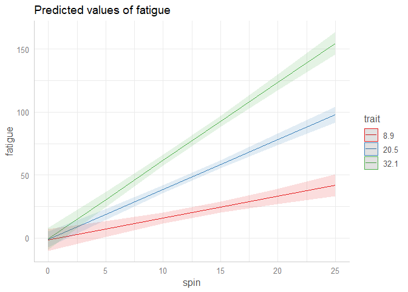
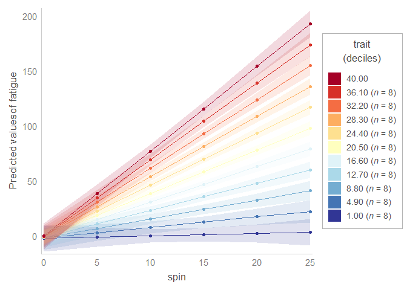
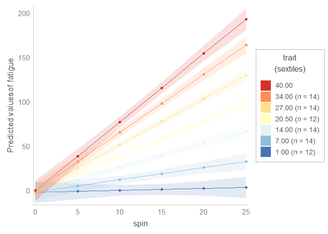

Whereas the direction of main effects can be interpreted from the sign of the estimate, the interpretation of interaction effects often requires plots. This task is facilitated by the R package [`sjPlot`](https://strengejacke.github.io/sjPlot). For instance, using the `plot_model` function, I plotted the interaction between two continuous variables. 

``` r
library(lme4)
#> Loading required package: Matrix
library(sjPlot)
#> Learn more about sjPlot with 'browseVignettes("sjPlot")'.
library(ggplot2)

theme_set(theme_sjplot())

# Create data partially based on code by Ben Bolker  
# from https://stackoverflow.com/a/38296264/7050882

set.seed(101)

spin = runif(800, 1, 24)

trait = rep(1:40, each = 20)

ID = rep(1:80, each = 10)

testdata <- data.frame(spin, trait, ID)

testdata$fatigue <- 
  testdata$spin * testdata$trait / 
  rnorm(800, mean = 6, sd = 2)

# Model
fit = lmer(fatigue ~ spin * trait + (1|ID),
           data = testdata, REML = TRUE)
#> boundary (singular) fit: see help('isSingular')

plot_model(fit, type = 'pred', terms = c('spin', 'trait'))
#> Warning: Ignoring unknown parameters: linewidth
```

<!-- -->

<sup>Created on 2023-06-24 with [reprex v2.0.2](https://reprex.tidyverse.org)</sup>


However, I needed an extra feature, as sjPlot by default breaks down the colour (`fill`) variable into few levels that do not include the minimum or the maximum values in my variable. What I would like to do is to stratify the colour variable into equally-sized levels that include the minimum and the maximum values. 

Furthermore, in the legend, I would also like to display the number of levels of a grouping variable (`ID`) that are contained in each level of the colour variable.

Below is a solution using [custom functions called `deciles_interaction_plot` and `sextiles_interaction_plot`](/2022/plotting-two-way-interactions-from-mixed-effects-models-using-ten-or-six-bins).

``` r
library(lme4)
#> Loading required package: Matrix
library(sjPlot)
library(ggplot2)

theme_set(theme_sjplot())

# Create data partially based on code by Ben Bolker  
# from https://stackoverflow.com/a/38296264/7050882

set.seed(101)

spin = runif(800, 1, 24)

trait = rep(1:40, each = 20)

ID = rep(1:80, each = 10)

testdata <- data.frame(spin, trait, ID)

testdata$fatigue <- 
  testdata$spin * testdata$trait / 
  rnorm(800, mean = 6, sd = 2)

# Model
fit = lmer(fatigue ~ spin * trait + (1|ID),
           data = testdata, REML = TRUE)
#> boundary (singular) fit: see help('isSingular')

# plot_model(fit, type = 'pred', terms = c('spin', 'trait'))

# Binning the colour variable into ten levels (deciles)

# Read in function from GitHub
source('https://raw.githubusercontent.com/pablobernabeu/language-sensorimotor-simulation-PhD-thesis/main/R_functions/deciles_interaction_plot.R')

deciles_interaction_plot(
  model = fit, 
  x = 'spin',
  fill = 'trait',
  fill_nesting_factor = 'ID'
)
#> Loading required package: dplyr
#> 
#> Attaching package: 'dplyr'
#> The following objects are masked from 'package:stats':
#> 
#>     filter, lag
#> The following objects are masked from 'package:base':
#> 
#>     intersect, setdiff, setequal, union
#> Loading required package: RColorBrewer
#> Loading required package: ggtext
#> Loading required package: Cairo
#> Warning in RColorBrewer::brewer.pal(n, pal): n too large, allowed maximum for palette Set1 is 9
#> Returning the palette you asked for with that many colors
#> Warning: Ignoring unknown parameters: linewidth
#> Scale for 'y' is already present. Adding another scale for 'y', which will
#> replace the existing scale.
#> Scale for 'colour' is already present. Adding another scale for 'colour',
#> which will replace the existing scale.
```

<!-- -->

``` r

# If you wanted or needed to make six levels (sextiles) instead 
# of ten, you could use the function sextiles_interaction_plot.

# Read in function from GitHub
source('https://raw.githubusercontent.com/pablobernabeu/language-sensorimotor-simulation-PhD-thesis/main/R_functions/sextiles_interaction_plot.R')

sextiles_interaction_plot(
  model = fit, 
  x = 'spin',
  fill = 'trait',
  fill_nesting_factor = 'ID'
)
#> Warning: Ignoring unknown parameters: linewidth
#> Scale for 'y' is already present. Adding another scale for 'y', which will
#> replace the existing scale.
#> Scale for 'colour' is already present. Adding another scale for 'colour',
#> which will replace the existing scale.
```

<!-- -->

<sup>Created on 2023-06-24 with [reprex v2.0.2](https://reprex.tidyverse.org)</sup>

