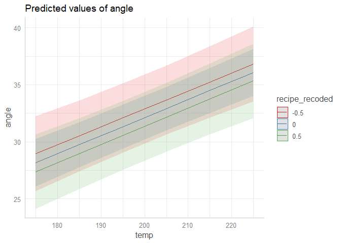
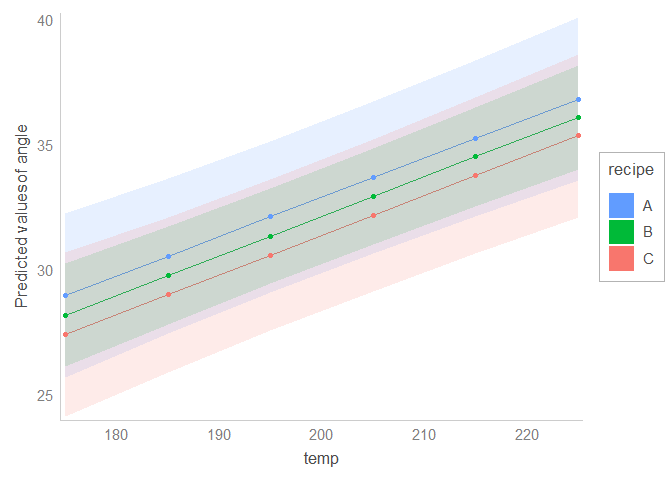

Whereas the direction of main effects can be interpreted from the sign of the estimate, the interpretation of interaction effects often requires plots. This task is facilitated by the R package [`sjPlot`](https://strengejacke.github.io/sjPlot). For instance, using the `plot_model` function, I plotted the interaction between a continuous variable and a categorical variable. The categorical variable was passed to the `fill` argument of plot_model. 

``` r
library(lme4)
#> Loading required package: Matrix
library(sjPlot)
#> Install package "strengejacke" from GitHub (`devtools::install_github("strengejacke/strengejacke")`) to load all sj-packages at once!
library(ggplot2)

theme_set(theme_sjplot())

cake$recipe_recoded = ifelse(cake$recipe == 'A', -0.5,
                             ifelse(cake$recipe == 'B', 0,
                                    ifelse(cake$recipe == 'C', 0.5,
                                           NA)))

fit = lmer(angle ~ recipe_recoded * temp + 
             (1|recipe_recoded:replicate), 
           cake, REML= FALSE)

plot_model(fit, type = 'pred', terms = c('temp', 'recipe_recoded'))
#> Warning: Ignoring unknown parameters: linewidth
```

<!-- -->

<sup>Created on 2023-06-24 with [reprex v2.0.2](https://reprex.tidyverse.org)</sup>


However, I needed an extra feature, as the categorical variable was not quite informative because it was a sum-coded transformation. Thus, I wanted the legend of the plot to show the values of the original variable (i.e., A, B and C), instead of those of the sum-coded variable that had been used in the model (i.e., -0.5, 0 and 0.5). 

Below is a solution using a custom function called [`alias_interaction_plot`](/2022/plotting-two-way-interactions-from-mixed-effects-models-using-alias-variables).

``` r
library(lme4)
#> Loading required package: Matrix
library(sjPlot)
library(ggplot2)

theme_set(theme_sjplot())

cake$recipe_recoded = ifelse(cake$recipe == 'A', -0.5,
                             ifelse(cake$recipe == 'B', 0,
                                    ifelse(cake$recipe == 'C', 0.5,
                                           NA)))

fit = lmer(angle ~ recipe_recoded * temp + 
             (1|recipe_recoded:replicate), 
           cake, REML= FALSE)

# plot_model(fit, type = 'pred', terms = c('temp', 'recipe_recoded'))

# Displaying the original variable instead

# Read in function from GitHub
source('https://raw.githubusercontent.com/pablobernabeu/language-sensorimotor-simulation-PhD-thesis/main/R_functions/alias_interaction_plot.R')

alias_interaction_plot(
  model = fit, 
  dataset = cake,
  x = 'temp',
  fill = 'recipe_recoded',
  fill_alias = 'recipe',
  fill_title = 'recipe'
)
#> Loading required package: rlang
#> Loading required package: dplyr
#> 
#> Attaching package: 'dplyr'
#> The following objects are masked from 'package:stats':
#> 
#>     filter, lag
#> The following objects are masked from 'package:base':
#> 
#>     intersect, setdiff, setequal, union
#> Loading required package: RColorBrewer
#> Loading required package: ggtext
#> Loading required package: Cairo
#> Warning: Ignoring unknown parameters: linewidth
#> Scale for 'y' is already present. Adding another scale for 'y', which will
#> replace the existing scale.
#> Scale for 'colour' is already present. Adding another scale for 'colour',
#> which will replace the existing scale.
```

<!-- -->

<sup>Created on 2023-06-24 with [reprex v2.0.2](https://reprex.tidyverse.org)</sup>


