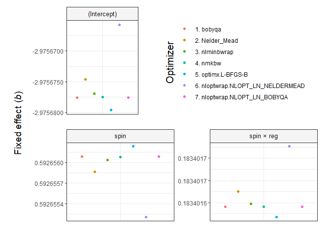

To assess whether convergence warnings render the results invalid, or on the contrary, the results can be deemed valid in spite of the warnings, [Bates et al. (2023)](https://cran.r-project.org/web/packages/lme4/lme4.pdf) suggest refitting models affected by convergence warnings with a variety of optimizers. The authors argue that, if the different optimizers produce practically-equivalent results, the results are valid. The `allFit` function from the ‘lme4’ package allows the refitting of models using a number of optimizers. To use the seven optimizers listed above, two extra packages must be installed: ‘dfoptim’ and ‘optimx’ (see lme4 manual). The output from `allFit` contains several statistics on the fixed and the random effects fitted by each optimizer. 
 
``` r
library(lme4)
#> Loading required package: Matrix
library(dfoptim)
library(optimx)

# Create data using code by Ben Bolker from 
# https://stackoverflow.com/a/38296264/7050882

set.seed(101)
spin = runif(600, 1, 24)
reg = runif(600, 1, 15)
ID = rep(c("1","2","3","4","5", "6", "7", "8", "9", "10"))
day = rep(1:30, each = 10)
testdata <- data.frame(spin, reg, ID, day)
testdata$fatigue <- testdata$spin * testdata$reg/10 * rnorm(30, mean=3, sd=2)

# Model
fit = lmer(fatigue ~ spin * reg + (1|ID),
           data = testdata, REML = TRUE)

# Refit model using all available algorithms
multi_fit = allFit(fit)
#> bobyqa : [OK]
#> Nelder_Mead : [OK]
#> nlminbwrap : [OK]
#> nmkbw : [OK]
#> optimx.L-BFGS-B : [OK]
#> nloptwrap.NLOPT_LN_NELDERMEAD : [OK]
#> nloptwrap.NLOPT_LN_BOBYQA : [OK]

# Show results 
summary(multi_fit)$fixef
#>                               (Intercept)      spin       reg  spin:reg
#> bobyqa                          -2.975678 0.5926561 0.1437204 0.1834016
#> Nelder_Mead                     -2.975675 0.5926559 0.1437202 0.1834016
#> nlminbwrap                      -2.975677 0.5926560 0.1437203 0.1834016
#> nmkbw                           -2.975678 0.5926561 0.1437204 0.1834016
#> optimx.L-BFGS-B                 -2.975680 0.5926562 0.1437205 0.1834016
#> nloptwrap.NLOPT_LN_NELDERMEAD   -2.975666 0.5926552 0.1437196 0.1834017
#> nloptwrap.NLOPT_LN_BOBYQA       -2.975678 0.5926561 0.1437204 0.1834016

# Read in function from GitHub
source('https://raw.githubusercontent.com/pablobernabeu/plot.fixef.allFit/main/plot.fixef.allFit.R')

plot.fixef.allFit(multi_fit, 
                  
                  select_predictors = c('spin', 'reg', 'spin:reg'), 
                  
                  # Increase padding at top and bottom of Y axis
                  multiply_y_axis_limits = 1.3,
                  
                  y_title = 'Fixed effect (*b*)')
#> Loading required package: dplyr
#> 
#> Attaching package: 'dplyr'
#> The following objects are masked from 'package:stats':
#> 
#>     filter, lag
#> The following objects are masked from 'package:base':
#> 
#>     intersect, setdiff, setequal, union
#> Loading required package: reshape2
#> Loading required package: stringr
#> Loading required package: scales
#> Loading required package: ggplot2
#> Loading required package: ggtext
#> Loading required package: patchwork
```

<!-- -->

``` r

# Alternative using plot-specific Y axes and other modified settings

plot.fixef.allFit(multi_fit, 
                  
                  select_predictors = c('spin', 'spin:reg'), 
                  
                  # Use plot-specific Y axis limits
                  shared_y_axis_limits = FALSE,
                  
                  decimal_places = 7, 
                  
                  # Move up Y axis title
                  y_title_hjust = 4.5,
                  
                  y_title = 'Fixed effect (*b*)')
```

<!-- -->

<sup>Created on 2023-06-26 with [reprex v2.0.2](https://reprex.tidyverse.org)</sup>
