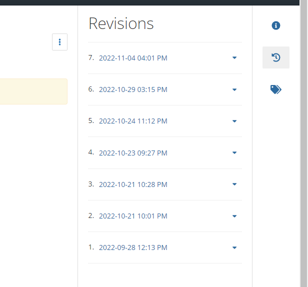

In the preparation of projects, files are often downloaded from OSF. It is good to document the URL addresses that were used for the downloads. These URLs can be provided in a code script ([see example](https://github.com/pablobernabeu/language-sensorimotor-simulation-PhD-thesis/blob/main/semanticpriming/data/semanticpriming_data_preparation.R#L294-L295)) or in a README file. Better yet, it's possible to specify the version of each file in the URL. This specification helps reduce the possibility of inaccuracies later, should any files be modified afterwards. 

The versions of files can be consulted on the right-hand side of the file page on OSF, as shown below. 

{width=550px}

Next, the appropriate version can be specified in the download link by appending `?version=`**X** at the end. For instance, the seventh version is specified in the link [https://osf.io/hx6tz/download`?version=7`](https://osf.io/hx6tz/download?version=7). 

 