Say, you need to set up a makeshift EEG lab in an office? Easy-peasy---only, try to move the hardware as little as possible, especially laptops with dongles sticking out. The rest is a trail of snapshots devoid of captions, a sink, a shower room and other paraphernalia, as this is only an ancillary, temporary, extraordinary little lab, and all those staples are within reach in our mainstream lab (see [Ledwidge et al., 2018](#references); [Luck, 2014](#references)).


<!-- Main Article Images (clickable to Open Modal) -->
<div class='image-gallery'>

<div class='imageContainer'>
  
  <i class='expand-icon fas fa-expand-alt'></i>
</div>

<div class='imageContainer'>
  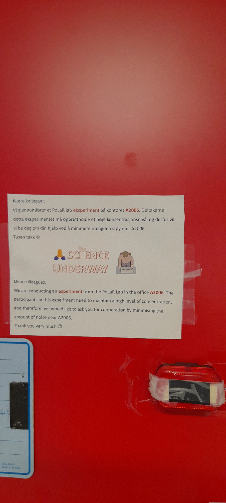
  <i class='expand-icon fas fa-expand-alt'></i>
</div>

<div class='imageContainer'>
  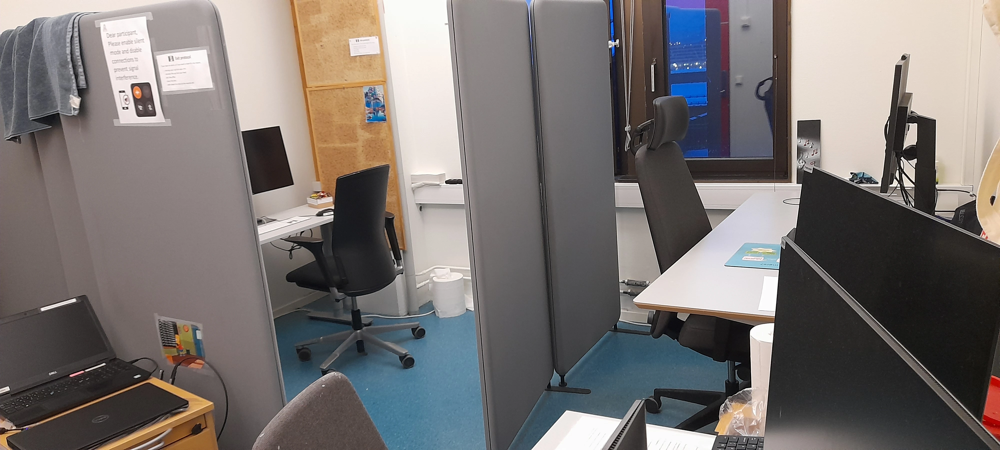
  <i class='expand-icon fas fa-expand-alt'></i>
</div>

<div class='imageContainer'>
  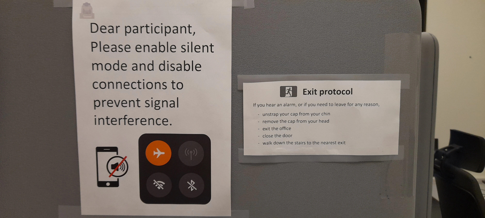
  <i class='expand-icon fas fa-expand-alt'></i>
</div>

<div class='imageContainer'>
  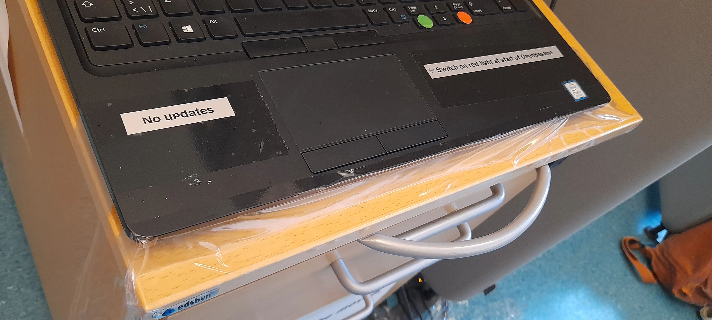
  <i class='expand-icon fas fa-expand-alt'></i>
</div>

<div class='imageContainer'>
  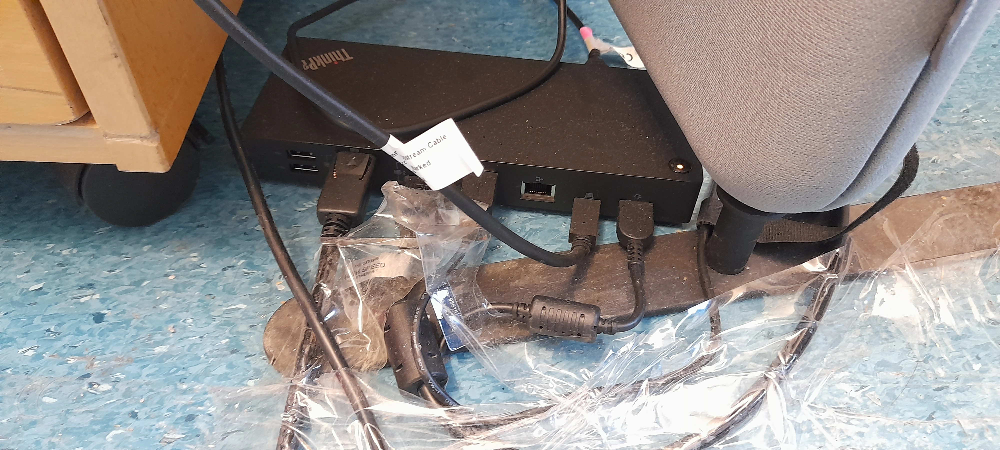
  <i class='expand-icon fas fa-expand-alt'></i>
</div>

<div class='imageContainer'>
  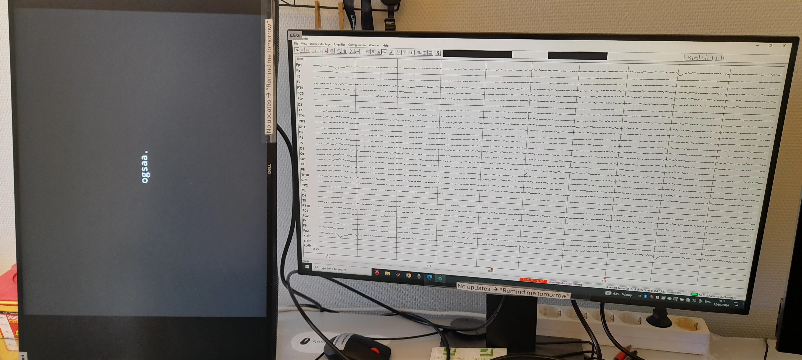
  <i class='expand-icon fas fa-expand-alt'></i>
</div>

<div class='imageContainer'>
  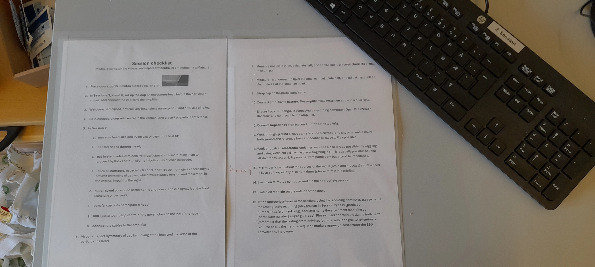
  <i class='expand-icon fas fa-expand-alt'></i>
</div>

</div>


<div class='alert alert-info' role='alert' style='margin-top: 4%; margin-bottom: 2%; padding-bottom: 0;'>
<i class='fas fa-smile'></i>  The needles below are *blunt*---that is, they do not pierce the skin. They're just used to put some gel into the cap to enable the detection of electrical activity in the brain. You can explore the non-invasive, painless procedure of EEG [here](/2024/lowering-impedance-in-electroencephalography-using-a-blunt-needle-electrolyte-gel-and-wiggling). 
</div>


<!-- Main Article Images (clickable to Open Modal) -->
<div class='image-gallery'>

<div class='imageContainer'>
  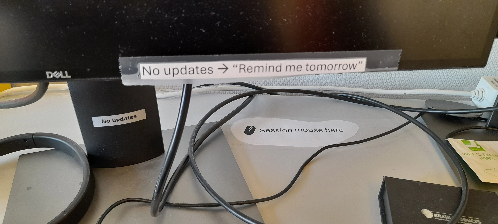
  <i class='expand-icon fas fa-expand-alt'></i>
</div>

<div class='imageContainer'>
  
  <i class='expand-icon fas fa-expand-alt'></i>
</div>

<div class='imageContainer'>
  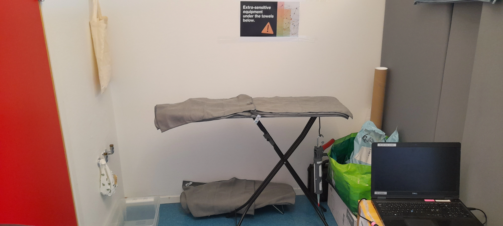
  <i class='expand-icon fas fa-expand-alt'></i>
</div>

<div class='imageContainer'>
  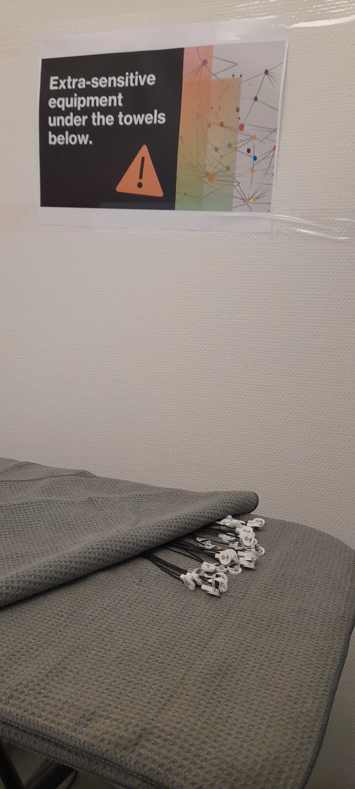
  <i class='expand-icon fas fa-expand-alt'></i>
</div>

<div class='imageContainer'>
  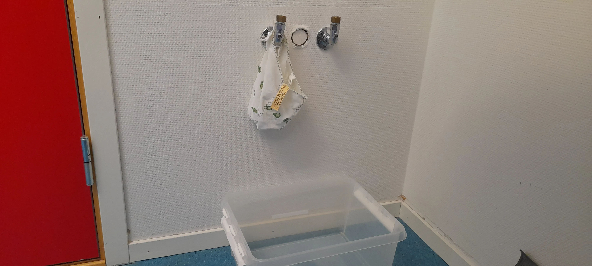
  <i class='expand-icon fas fa-expand-alt'></i>
</div>

<div class='imageContainer'>
  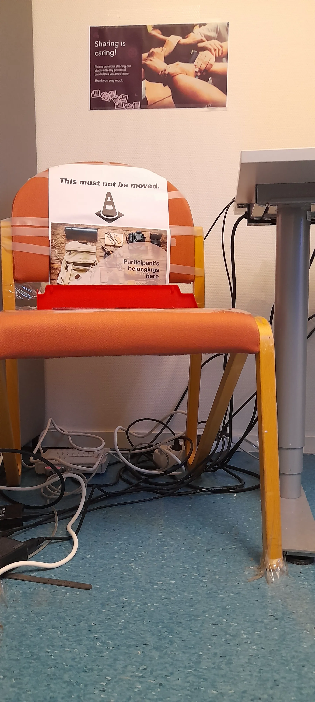
  <i class='expand-icon fas fa-expand-alt'></i>
</div>

<div class='imageContainer'>
  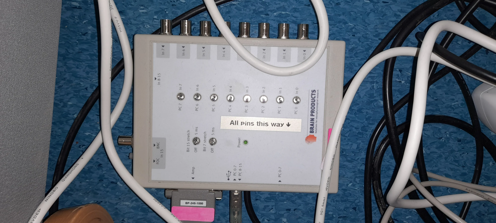
  <i class='expand-icon fas fa-expand-alt'></i>
</div>

<div class='imageContainer'>
  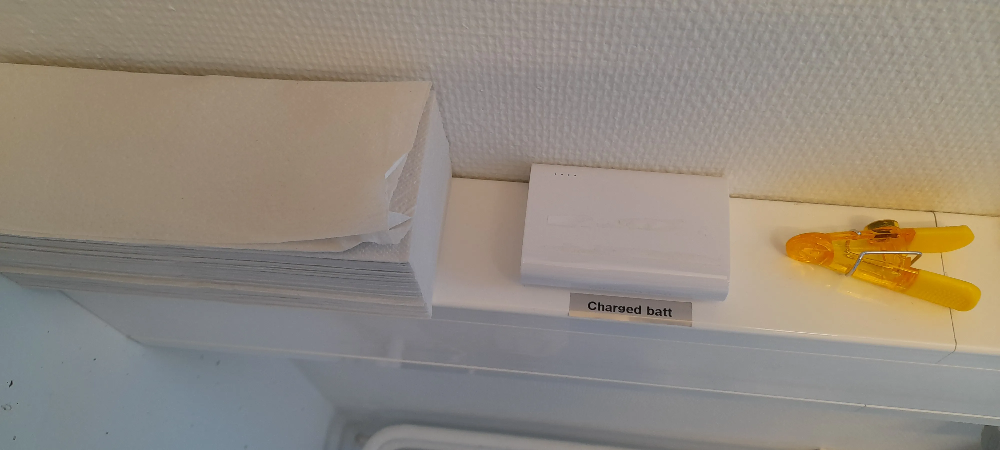
  <i class='expand-icon fas fa-expand-alt'></i>
</div>

<div class='imageContainer'>
  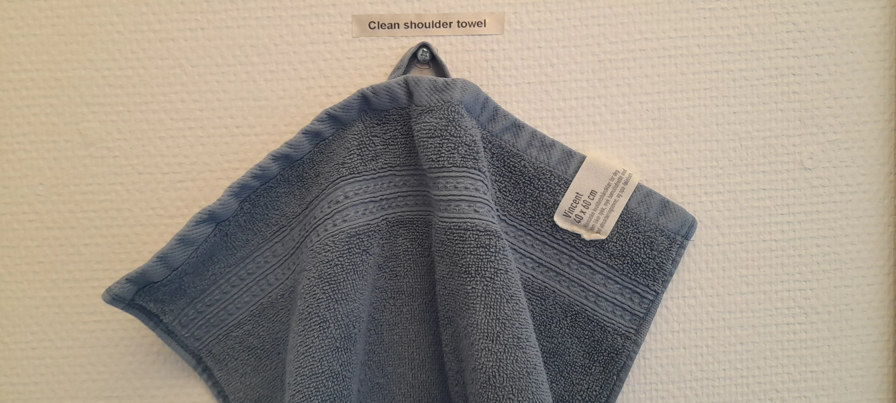
  <i class='expand-icon fas fa-expand-alt'></i>
</div>

<div class='imageContainer'>
  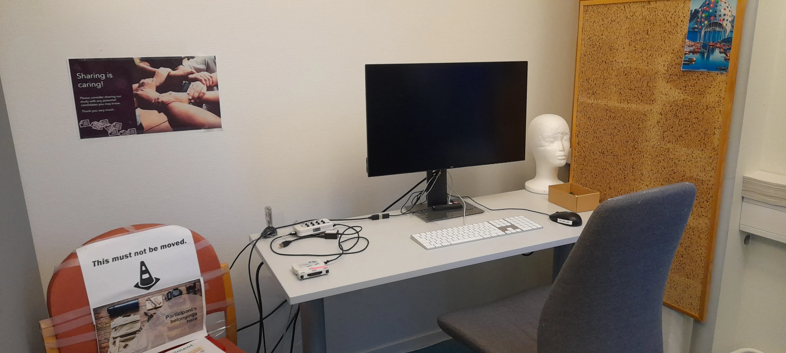
  <i class='expand-icon fas fa-expand-alt'></i>
</div>

<div class='imageContainer'>
  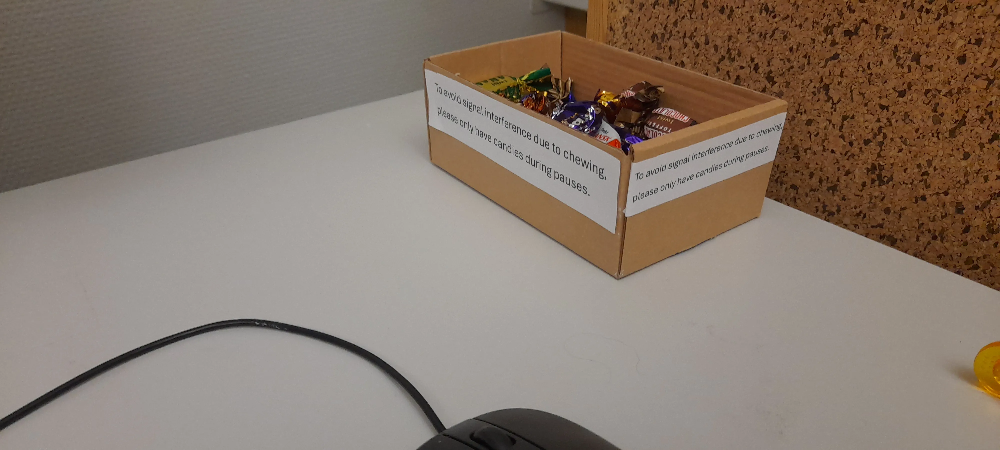
  <i class='expand-icon fas fa-expand-alt'></i>
</div>

<div class='imageContainer'>
  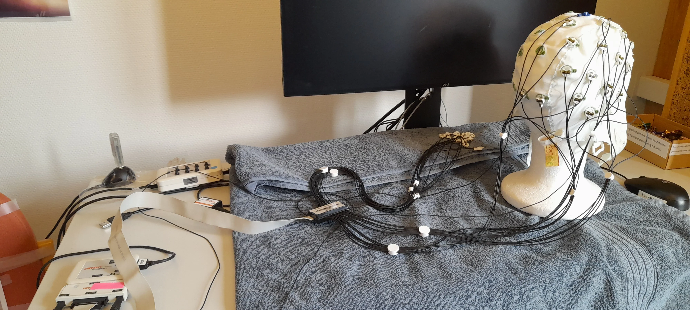
  <i class='expand-icon fas fa-expand-alt'></i>
</div>

<div class='imageContainer'>
  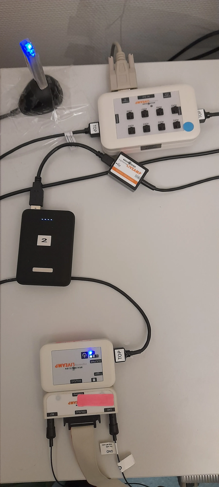
  <i class='expand-icon fas fa-expand-alt'></i>
</div>

<div class='imageContainer'>
  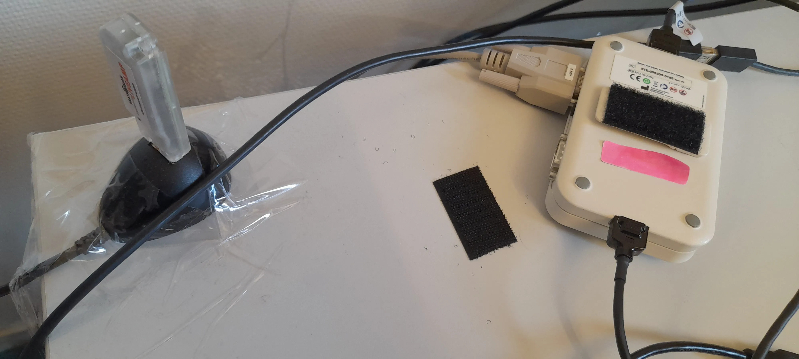
  <i class='expand-icon fas fa-expand-alt'></i>
</div>

<div class='imageContainer'>
  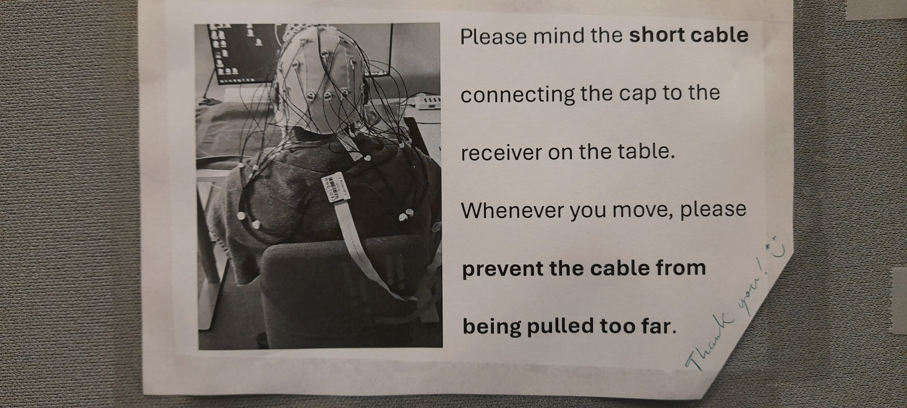
  <i class='expand-icon fas fa-expand-alt'></i>
</div>

</div>


<br>


Need to return to the main lab? No problem! The tidyverse has got your back. 

```{r eval=FALSE}

library(tidyr)

makeshift_lab %>%
  pivot_longer(!superfluous, names_to = 'registrar', values_to = 'Mephis') %>%
  filter(view == 'outside') %>%
  pull(leg)

```

<div class='imageContainer'>
  
  <i class='expand-icon fas fa-expand-alt'></i>
</div>


<!-- Modal -->
<div id='myModal' class='imageModal'>
<div class='imageModal-text imageClose'>Click here or press <kbd style='font-size: 90%; color:white; background-color:#303030;'>Esc</kbd> to close</div>
<div class='imageModal-wrapper'>
  <div class='imageModal-content-wrapper'>
  <!-- Images will be dynamically added here by JavaScript -->
  </div>
</div>
<a class='prev'>❮</a>
<a class='next'>❯</a>
</div>


<br>


### References

Ledwidge, P., Foust, J., & Ramsey, A. (2018). Recommendations for developing an EEG laboratory at a primarily undergraduate institution. *Journal of Undergraduate Neuroscience Education, 17*(1), A10. https://www.ncbi.nlm.nih.gov/pmc/articles/PMC6312138

Luck, S. J. (2014). Online Chapter 16: Setting up and running an ERP lab. In S. J. Luck (Ed.), *An introduction to
the event-related potential technique*. Cambridge, MA: MIT Press. Retrieved from http://mitp-content-server.mit.edu:18180/books/content/sectbyfn?collid=books_pres_0&fn=Ch_16_0.pdf&id=8575

