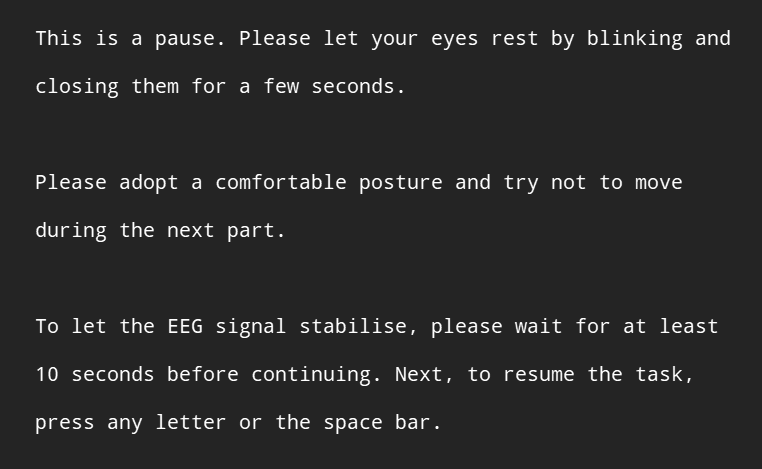

Electroencephalographic (EEG) signals are often contaminated by muscle artifacts such as blinks, jaw clenching and (of course) yawns, which generate electrical activity that can obscure the brain signals of interest. These artifacts typically manifest as large, abrupt changes in the EEG signal, complicating data interpretation and analysis. To reduce the likelihood of muscle artifacts, participants can be instructed during the preparatory phase of the session to minimize blinking and to keep their facial muscles relaxed. Furthermore, the design of the session can include verification stages that allow experimenters to verify the quality of the live EEG signal before letting the session continue.

## Participant briefing

<iframe src="https://www.youtube-nocookie.com/embed/9Mbv6bUZlqY" frameborder="0" allowfullscreen
style = "position:absolute; top:0; left:0; width:100%; height:100%;"></iframe>

## Verification stages

Verification stages allow the experimenters to verify the quality of the live EEG signal before letting the session continue. The following example includes an abbreviated reminder, &nbsp;i.s.r , prompting the experimenter to verify the **i**mpedance and the **s**ignal before starting to **r**ecord the signal. The orange stripes flag up the need for the experimenter to intervene.

</img>

The *impedance* check is performed by verifying the impedance on each electrode, which has a dedicated function in most EEG software. Sometimes, especially if some time has elapsed since the initial impedance work, one or two electrodes have to be revised, which can be done quickly. 

The *signal* check complements the previous check. Once all electrodes present a low-enough impedance and a calm-enough signal---usually taking a couple of minutes---, the experimenter begins recording the signal. 

Next, the experimenter presses the keys that are---unbeknownst to participants---needed to proceed with the session. The screenshot below shows an example setup in OpenSesame, whereby the letter <kbd>C</kbd> must be pressed twice to advance. 

</img>

The advice is reinforced before returning the control of the screen to the participant (i.e., this screen is the last one that requires the experimenter's intervention). 

</img>

Later, during the breaks, the advice is reiterated, and a buffer period is introduced to best preserve the trials immediately following the breaks.

</img>

## Outcome

The combination of verbal and written instructions, along with verification stages, can greatly contribute to the quality of raw EEG data, which in turn helps preserve more data in the [preprocessing](/2020/event-related-potentials-why-and-how-i-used-them/#preprocessing-erps).

