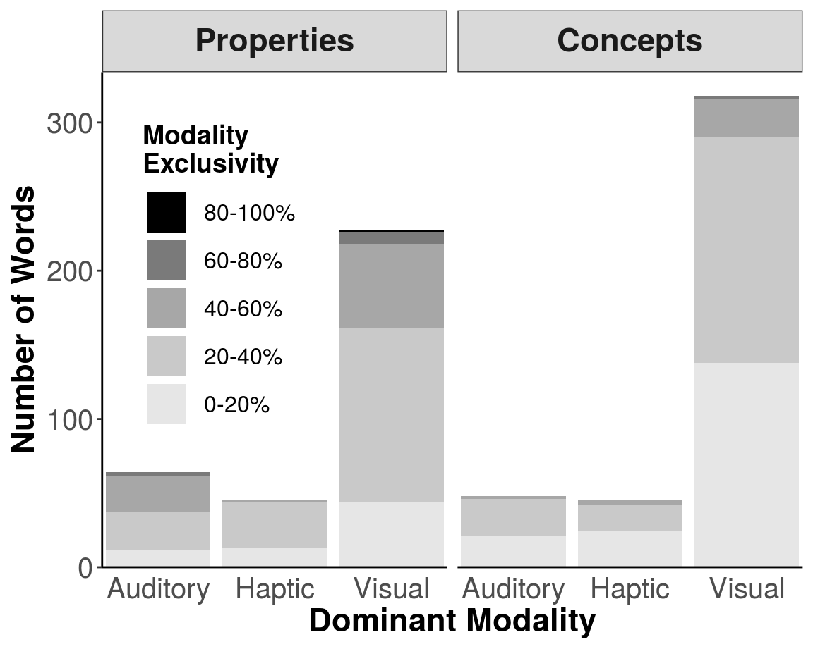
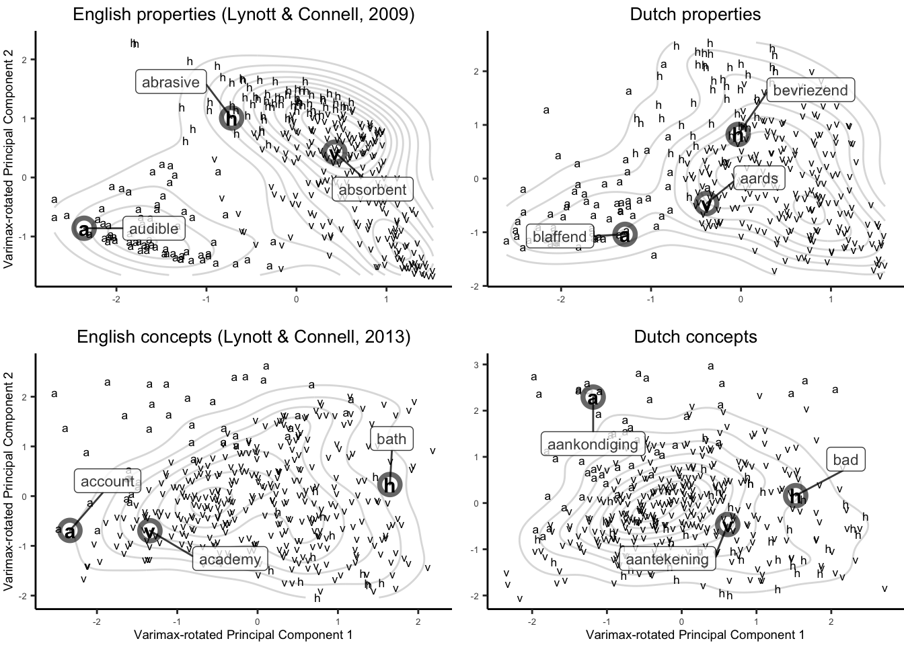

<!-- Begin definition of layout parameters -->
<head>

<!-- Load Bootstrap libraries for icons -->
<link rel="stylesheet" href="https://cdnjs.cloudflare.com/ajax/libs/font-awesome/4.7.0/css/font-awesome.min.css">
<link rel='stylesheet' href='https://use.fontawesome.com/releases/v5.7.0/css/all.css' integrity='sha384-lZN37f5QGtY3VHgisS14W3ExzMWZxybE1SJSEsQp9S+oqd12jhcu+A56Ebc1zFSJ' crossorigin='anonymous'>

<!-- Javascript function to enable a hovering tooltip -->

<!-- Javascript function to add hyperlink to logo image -->

</head>

<i class="fas fa-code" aria-hidden="true"></i> Info {style="background-color: #FCFCFC; data-width: 100%; width: 900px; margin: 0 auto;"}
=======================================================================

Column {style="height:1300px; background-color:#FCFCFC;"}
--------------------------------------------------------

 Desktop computer recommended. Please allow a few seconds to load. 

 This is a reduced version of a dashboard. 

<!-- Links -->

<a href="https://pablobernabeu.shinyapps.io/Dutch-modality-exclusivity-norms/" target="_top" style='color:#827182; border-bottom:none !important; font-size: 17px; font-weight: bold; font-family: "Courier New", Courier, monospace;'> <i class="fas fa-drafting-compass" aria-hidden="true" style='padding-top:4px; padding-bottom:6px; font-size:19px; color:#5A647B;'></i> See complete dashboard </a>

<a href="https://osf.io/58gzs/" target="_top" style="color:#577787; border-bottom:none !important;font-size: 18px; font-weight: bold; font-family: 'Courier New', Courier, monospace;"> <i class='fas fa-database' aria-hidden="true" style='font-size:16px; color:#577787'></i> Data </a>

<a href="https://github.com/pablobernabeu/Modality-exclusivity-norms-747-Dutch-English-replication/blob/master/Dutch-modality-exclusivity-norms-RPubs.Rmd" target="_top" style="color:#577787; border-bottom:none !important;font-size: 18px; font-weight: bold; font-family: 'Courier New', Courier, monospace;"> <i class='fab fa-r-project' aria-hidden="true" style='font-size:16px; color:#577787'></i><i class='fas fa-code' aria-hidden="true" style='font-size:9px; color:#526772'></i> Code </a>

<a href="http://creativecommons.org/licenses/by/4.0/" rel="Attribution licence" target="_top" style="color:#CEC7BF; font-size:13px;"> Licence </img> </a>

<!-- Enable this once the Binder feature is enabled (https://github.com/jupyter/repo2docker/issues/799) -->
<!-- 
 In case of downtime, please [visit here](https://mybinder.org/v2/gh/pablobernabeu/Modality-exclusivity-norms-747-Dutch-English-replication/master?urlpath=shiny/Shiny-app/){target="_top"}. 
 -->

## Information

This dashboard presents the data and analyses of a set of modality exclusivity norms for Dutch. Various tabs and interactive plots are available. In addition, the data set is available in [CSV format](https://osf.io/ge7pn/){target="_top"} and [Excel format including column definitions](https://osf.io/58gzs/){target="_top"}.

The norms, which are ratings of linguistic stimuli, served a twofold purpose: first, the creation of linguistic stimuli (Bernabeu, 2018; see also Speed & Majid, 2017), and second, a conceptual replication of Lynott and Connell's (2009, 2013) analyses. In the collection of the ratings, forty-two respondents completed surveys for the properties or the concepts separately. Each word was rated by eight participants on average, with a minimum of five (e.g., for *bevriezend*) and a maximum of ten ratings per word (e.g., for *donzig*). The [instructions to participants](https://osf.io/ungey/){target="_top"} were similar to those used by Lynott and Connell (2009, 2013), except that we elicited three modalities (auditory, haptic, visual) instead of five.

> 
 'This is a stimulus validation for a future experiment. The task is to rate how much you experience everyday' [properties/concepts] 'using three different perceptual senses: feeling by touch, hearing and seeing. Please rate every word on each of the three senses, from 0 (not experienced at all with that sense) to 5 (experienced greatly with that sense). If you do not know the meaning of a word, leave it blank.' 

### Definitions (as in Lynott & Connell, 2009, 2013)

* Dominant modality: Highest-rated modality;
* Modality exclusivity: Range of the three modality ratings divided by the sum;
* Perceptual strength: Highest rating across modalities.

##### Figure 1. Number of words in the norms per word category, dominant modality, and modality exclusivity.   [<i class='fas fa-external-link-alt' aria-hidden=TRUE style='font-size:7'></i> Github](https://raw.githubusercontent.com/pablobernabeu/Modality-exclusivity-norms-747-Dutch-English-replication/master/stacked_exc.png){target="_top"}. {style='text-align:justify; padding-left:5px; padding-right:5px; line-height: 1.4;'}

These norms were validated in an experiment demonstrating that shifts across trials with different dominant modalities incurred semantic processing costs ([Bernabeu, Willems, & Louwerse, 2017](https://mindmodeling.org/cogsci2017/papers/0318/index.html){target="_top"}). All data for that study are [available](https://osf.io/97unm/wiki/home/){target="_top"}, including a [dashboard](https://pablobernabeu.shinyapps.io/ERP-waveform-visualization_CMS-experiment/){target="_top"} (in case of downtime of the dashboard site, please see [this alternative](https://mybinder.org/v2/gh/pablobernabeu/Modality-switch-effects-emerge-early-and-increase-throughout-conceptual-processing/master?urlpath=shiny/Shiny-app/){target="_top"}).

The [**properties**](#properties){style='background-color:#FDFFFF'} and the [**concepts**](#concepts){style='background-color:#FDFFFF'} may also be consulted together on a [**table**](#table){style='background-color:#FDFFFF'}. Distinct relationships emerged among the modalities, with the visual and haptic modalities being more related to each other than to the auditory modality. This ties in with findings that, in conceptual processing, modalities can be collated based on language statistics (Louwerse & Connell, 2011). Furthermore, properties were found to be more strongly perceptual than concepts ([**cf. English norms by Lynott & Connell, 2009, 2013**](#section-cf-lc-english-norms){style='background-color:#FDFFFF'}).

##### Figure 2. Dutch norms compared to English norms (reanalysis of Lynott & Connell, 2009, 2013, narrowed to three modalities) based on a principal component analysis of the auditory, haptic, and visual ratings for each word. Letters indicate the dominant modality of each word (*a* = auditory, *h* = haptic, *v* = visual), and contours further display the degree of consistency of the modalities. [<i class='fas fa-external-link-alt' aria-hidden=TRUE style='font-size:7'></i> Github](https://raw.githubusercontent.com/pablobernabeu/Modality-exclusivity-norms-747-Dutch-English-replication/master/allfour_lowres.png){target="_top"}. {style='text-align:justify; padding-left:5px; padding-right:5px; line-height:1.4;'}

<!-- Begin two-column format -->

  

The norms also served to investigate [**sound symbolism**](#sound-symbolism){style='background-color:#FDFFFF'}, which is the relation between the form of words and their meaning. The form of words rests on their sound more than on their visual or tactile properties (at least in spoken language). Therefore, auditory ratings should more reliably predict the lexical properties of words (length, frequency, distinctiveness) than haptic or visual ratings would. Lynott and Connell's (2013) findings were replicated, as auditory ratings were either the best predictor of lexical properties, or yielded an effect that was opposite in polarity to the effects of haptic and visual ratings. The present analyses and further ones will be reported in a forthcoming paper.

All data and code are [available for re-use](https://osf.io/brkjw/wiki/home/){target="_top"} under a [CC BY licence](https://creativecommons.org/licenses/by/4.0/){target="_top"}, by citing the source:

  

  

</img>

 Sound symbolism is a psycholinguistic effect whereby the pronunciation and the meaning of words bear a non-arbitrary relationship. For instance, when people are asked to match the pseudowords *bouba* and *kiki* to the above objects, the vast majority name the angular object *kiki* and the smooth one *bouba* (Köhler, 1929; Sourav et al., 2019). 

 Image: <a href="https://commons.wikimedia.org/wiki/File:Booba-Kiki.svg" target="_top" title="via Wikimedia Commons">Monochrome version 1 June 2007 by BendžVectorized with Inkscape --Qef (talk) 21:21, 23 June 2008 (UTC)</a> [<a href="http://creativecommons.org/licenses/by-sa/3.0/" target="_top">CC BY-SA</a>].

  

<!-- End two-column format -->

> 
 Bernabeu, P., Willems, R. M., & Louwerse, M. M. (2017). Modality switch effects emerge early and increase throughout conceptual processing: Evidence from ERPs [Data dashboard for modality exclusivity norms]. Retrieved from https://pablobernabeu.shinyapps.io/Dutch-Modality-Exclusivity-Norms/.

### External corpora

* Concreteness and age of acquisition: Norms by Brysbaert, Warriner, and Kuperman (2014);
* Phonological and orthographic neighbours: DutchPOND (Marian et al., 2012);
* Word frequency and contextual diversity: SUBTLEX-NL (Keuleers, Brysbaert, & New, 2010);
* Lemma frequency: CELEX (Baayen, Piepenbrock, & van Rijn, 1993).

### Acknowledgements {style='padding-top:5px;'}

This research was greatly supported by the help of Tilburg University, which provided funding; Wendy Leijten, who provided linguistic advice; and the forty-two Tilburg University students who completed the surveys.

### References {style='padding-top:5px;'}

Baayen, R. H., Piepenbrock, R., & van Rijn, H. (1993). *The CELEX Lexical Database* [CD-ROM]. Philadelphia: Linguistic Data Consortium, University of Pennsylvania.

Bernabeu, P.  (2018). *Dutch  modality  exclusivity  norms  for  336  properties  and  411  concepts* [Unpublished manuscript]. School of Humanities, Tilburg University. Tilburg, Netherlands. https://psyarxiv.com/s2c5h.

Bernabeu, P., Willems, R. M., & Louwerse, M. M. (2017). Modality switch effects emerge early and increase throughout conceptual processing: Evidence from ERPs. In G. Gunzelmann, A. Howes,  T. Tenbrink, & E. J. Davelaar (Eds.), *Proceedings of the 39th Annual Conference of the Cognitive Science Society* (pp. 1629-1634). Austin, TX: Cognitive Science Society. [https://mindmodeling.org/cogsci2017/papers/0318/index.html](https://mindmodeling.org/cogsci2017/papers/0318/index.html){target="_top"}.

Brysbaert, M., Warriner, A.B., & Kuperman, V. (2014). Concreteness ratings for 40 thousand generally known English word lemmas. *Behavior Research Methods, 46*, 3, 904-911.  
[https://doi.org/10.3758/s13428-013-0403-5](https://doi.org/10.3758/s13428-013-0403-5){target="_top"}.

Field, A. P., Miles, J., & Field, Z. (2012). *Discovering Statistics Using R*. London, UK: Sage.

Keuleers, E., Brysbaert, M. & New, B. (2010). SUBTLEX-NL: A new frequency measure for Dutch words based on film subtitles. *Behavior Research Methods, 42*, 3, 643-650. [https://doi.org/10.3758/BRM.42.3.643](https://doi.org/10.3758/BRM.42.3.643){target="_top"}.

Köhler, W. (1929). *Gestalt Psychology*. New York: Liveright.

Louwerse, M., & Connell, L. (2011). A taste of words: Linguistic context and perceptual simulation predict the modality of words. *Cognitive Science, 35*, 2, 381-98. [https://doi.org/10.1111/j.1551-6709.2010.01157.x](https://doi.org/10.1111/j.1551-6709.2010.01157.x){target="_top"}.

Lynott, D., & Connell, L. (2009). Modality exclusivity norms for 423 object concepts. *Behavior Research Methods, 41*, 2, 558-564. [https://doi.org/10.3758/BRM.41.2.558](https://doi.org/10.3758/BRM.41.2.558){target="_top"}.

Lynott, D., & Connell, L. (2013). Modality exclusivity norms for 400 nouns: The relationship between perceptual experience and surface word form. *Behavior Research Methods, 45*, 2, 516-526.  
[https://doi.org/10.3758/s13428-012-0267-0](https://doi.org/10.3758/s13428-012-0267-0){target="_top"}.

Marian, V., Bartolotti, J., Chabal, S., & Shook, A. (2012). CLEARPOND: Cross-Linguistic Easy-Access Resource for Phonological and Orthographic Neighborhood Densities. *PLoS ONE, 7*, 8: e43230.  
[https://doi.org/10.1371/journal.pone.0043230](https://doi.org/10.1371/journal.pone.0043230){target="_top"}.

Speed, L. J., & Majid, A. (2017). Dutch modality exclusivity norms: Simulating perceptual modality in space. *Behavior Research Methods, 49*, 6, 2204-2218. [https://doi.org/10.3758/s13428-017-0852-3](https://doi.org/10.3758/s13428-017-0852-3){target="_top"}.

Sourav, S., Kekunnaya, R., Shareef, I., Banerjee, S., Bottari, D., & Röder, B. (2019). A protracted sensitive period regulates the development of cross-modal sound–shape associations in humans. *Psychological Science, 30*, 10, 1473–1482. [https://doi.org/10.1177/0956797619866625](https://doi.org/10.1177/0956797619866625){target="_top"}.

## Contact {style='padding-top:5px;'}

Pablo Bernabeu. Email: p.bernabeu@lancaster.ac.uk.

[Webpage](http://www.research.lancs.ac.uk/portal/en/people/pablo-de-juan-bernabeu){target="_top"}

 

Table {#table style="background-color:#FCFCFC;"}
=======================================================================

Column {style="data-width:100%; position:static; height:1000px;"}
-----------------------------------------------------------------------

###  **Property and concept words**. Please scroll horizontally and vertically. Column information available by hovering on header. Columns may be simultaneously filtered and sorted (e.g., to find out range), and words may be searched under the header. [CSV](https://osf.io/ge7pn/){target="_top"} and [Excel spreadsheet](https://osf.io/58gzs/){target="_top"} also available. {style="margin-top:17px; padding-top:25px; text-align:justify;"}

preserve7893b7a5a7b94b25

<i class="fas fa-chart-bar" aria-hidden="true"></i> Properties {data-orientation=rows style="position: absolute !important;"}
=======================================================================

<!-- Inputs {.sidebar} -->
<!-- ----------------------------------------------------------------------- -->

<!-- 
 -->

<!-- 
 -->

<!-- Chunk right below removed from mobiles because it's badly displayed -->
<!-- #### {.desktop-only} -->

<!-- Show again on all devices -->
<!-- #### -->

<!-- #### **Modality** -->

<!-- #### **Concreteness** -->

<!-- #### **Length** -->

<!-- #### **Word frequency** -->

<!-- #### **Distinctiveness** -->

<!-- #### **Age of acquisition** -->

<!-- 
 -->

<!-- #### **Definitions** -->

<!-- **Principal component analysis (PCA):** Method for reducing dimensionality of data while retaining the main patterns ([read more](https://www.nature.com/articles/nmeth.4346){target="_top"}). -->

<!-- 
<b> Dominant modality: </b> Highest-rated modality. 
 -->

<!-- 
<b> Modality exclusivity: </b> Range of the three modality ratings divided by the sum. 
 -->

<!-- 
<b> Perceptual strength: </b>  Highest rating across modalities. 
 -->

<!-- #### **Corpora** -->

<!-- **Concreteness and age of acquisition:** [Norms by Brysbaert, Warriner, and Kuperman (2014)](#info). -->

<!-- **Phonological and orthographic neighbours**: [DutchPOND (Marian et al., 2012)](#info). -->

<!-- **Word frequency and contextual diversity**: [SUBTLEX-NL (Keuleers, Brysbaert, & New, 2010)](#info). -->

<!-- **Lemma frequency**: [CELEX (Baayen, Piepenbrock, & van Rijn, 1993)](#info). -->

<!-- 
 -->

Row {data-height=1000 padding-bottom=7}
-----------------------------------------------------------------------

###  Principal component analysis (PCA) reflecting different relationships among the modalities. The visual and haptic modalities were related, whereas the auditory modality was more independent (see PCA loadings below; cf. <a href="#section-cf-lc-english-norms">Lynott & Connell's 2009 data for English</a>). <a href="https://osf.io/ge7pn/" target="_top">CSV</a> and <a href="https://osf.io/58gzs/" target="_top">Excel spreadsheet</a> also available. {style="text-align:justify; padding-top: 30px !important; padding-bottom: 5px !important; padding-left: 4px !important; padding-right: 4px !important;"}

<!-- create margin -->

 

preserve1569ed5ef1959968

<!-- create margin -->

 

Row {style="data-width:100%;"}
-----------------------------------------------------------------------

###  <b>Loadings of principal components (PC) in the form of correlations.</b> Coefficients above <i>r</i> = &plusmn;.70 (i.e., 50% shared variance) shown in bold. When the three modalities were reduced to two principal components, the visual and haptic modalities loaded onto the components similarly, both with positive polarities, whereas the auditory modality was relatively independent, with a negative polarity. {style="font-size: 15px !important; text-align:justify; padding-top: 8px !important; padding-bottom: 5px !important; padding-left: 4px !important; padding-right: 4px !important;"}

<!-- create margin -->

 

<table class="table table-striped" style="width: auto !important; margin-left: auto; margin-right: auto;">
 <thead>
  <tr>
   <th style="text-align:left;"> Variable </th>
   <th style="text-align:left;"> PC1 </th>
   <th style="text-align:left;"> PC2 </th>
  </tr>
 </thead>
<tbody>
  <tr>
   <td style="text-align:left;"> Auditory </td>
   <td style="text-align:left;"> -.85 </td>
   <td style="text-align:left;"> -.16 </td>
  </tr>
  <tr>
   <td style="text-align:left;"> Haptic </td>
   <td style="text-align:left;"> .11 </td>
   <td style="text-align:left;"> .99 </td>
  </tr>
  <tr>
   <td style="text-align:left;"> Visual </td>
   <td style="text-align:left;"> .87 </td>
   <td style="text-align:left;"> .08 </td>
  </tr>
</tbody>
</table>

<i class="fas fa-chart-bar" aria-hidden="true"></i> Concepts {data-orientation=rows style="position: absolute !important;"}
=======================================================================

<!-- Inputs {.sidebar} -->
<!-- ----------------------------------------------------------------------- -->

<!-- 
 -->

<!-- 
 -->

<!-- Chunk right below removed from mobiles because it's badly displayed -->
<!-- #### {.desktop-only} -->

<!-- Show again on all devices -->
<!-- #### -->

<!-- #### **Modality** -->

<!-- #### **Concreteness** -->

<!-- #### **Length** -->

<!-- #### **Word frequency** -->

<!-- #### **Distinctiveness** -->

<!-- #### **Age of acquisition** -->

<!-- 
 -->

<!-- #### **Definitions** -->

<!-- **Principal component analysis (PCA):** Method for reducing dimensionality of data while retaining the main patterns ([read more](https://www.nature.com/articles/nmeth.4346){target="_top"}). -->

<!-- 
<b> Dominant modality: </b> Highest-rated modality. 
 -->

<!-- 
<b> Modality exclusivity: </b> Range of the three modality ratings divided by the sum. 
 -->

<!-- 
<b> Perceptual strength: </b>  Highest rating across modalities. 
 -->

<!-- #### **Corpora** -->

<!-- **Concreteness and age of acquisition:** [Norms by Brysbaert, Warriner, and Kuperman (2014)](#info). -->

<!-- **Phonological and orthographic neighbours**: [DutchPOND (Marian et al., 2012)](#info). -->

<!-- **Word frequency and contextual diversity**: [SUBTLEX-NL (Keuleers, Brysbaert, & New, 2010)](#info). -->

<!-- **Lemma frequency**: [CELEX (Baayen, Piepenbrock, & van Rijn, 1993)](#info). -->

<!-- 
 -->

Row {data-height=1000 padding-bottom=7}
-----------------------------------------------------------------------

###  Principal component analysis (PCA) reflecting different relationships among the modalities. The visual and haptic modalities were related, whereas the auditory modality was more independent (see PCA loadings below; cf. <a href="#section-cf-lc-english-norms">Lynott & Connell's 2009 data for English</a>). <a href="https://osf.io/ge7pn/" target="_top">CSV</a> and <a href="https://osf.io/58gzs/" target="_top">Excel spreadsheet</a> also available. {style="text-align:justify; padding-top: 30px !important; padding-bottom: 5px !important; padding-left: 4px !important; padding-right: 4px !important;"}

<!-- create margin -->

 

preserve5301365d92b07b95

<!-- create margin -->

 

Row {style="data-width:100%;"}
-----------------------------------------------------------------------

###  <b>Loadings of principal components (PC) in the form of correlations.</b> Coefficients above <i>r</i> = &plusmn;.70 (i.e., 50% shared variance) shown in bold. When the three modalities were reduced to two principal components, visual and haptic ratings shared one component, whereas the auditory modality was relatively independent, having its own component. {style="font-size: 15px !important; text-align:justify; padding-top: 8px !important; padding-bottom: 5px !important; padding-left: 4px !important; padding-right: 4px !important;"}

<!-- create margin -->

 

<table class="table table-striped" style="width: auto !important; margin-left: auto; margin-right: auto;">
 <thead>
  <tr>
   <th style="text-align:left;"> Variable </th>
   <th style="text-align:left;"> PC1 </th>
   <th style="text-align:left;"> PC2 </th>
  </tr>
 </thead>
<tbody>
  <tr>
   <td style="text-align:left;"> Auditory </td>
   <td style="text-align:left;"> .03 </td>
   <td style="text-align:left;"> .99 </td>
  </tr>
  <tr>
   <td style="text-align:left;"> Haptic </td>
   <td style="text-align:left;"> .85 </td>
   <td style="text-align:left;"> -.09 </td>
  </tr>
  <tr>
   <td style="text-align:left;"> Visual </td>
   <td style="text-align:left;"> .84 </td>
   <td style="text-align:left;"> .12 </td>
  </tr>
</tbody>
</table>

Cf. L&C English Norms
=======================================================================

<b> Comparison with Lynott and Connell's (2009, 2013) English norms ([see complete data](http://www.lancaster.ac.uk/staff/connelll/lab/norms.html){target="_top"}).</b> In both languages, properties were visibly more perceptual than concepts.

Column {style="height:50%;" data-padding=1}
-----------------------------------------------------------------------

### Reanalysis of [Lynott and Connell's (2009) English properties](https://doi.org/10.3758/BRM.41.2.558){target="_top"} narrowed to three modalities

preserve4bb13965349049c4

### Reanalysis of [Lynott and Connell's (2013) English concepts](https://doi.org/10.3758/s13428-012-0267-0){target="_top"} narrowed to three modalities

preserve25e40e7de0eb1faf

Column {style="height:50%;" data-padding=1}
-----------------------------------------------------------------------

### &nbsp;&nbsp;&nbsp; [Dutch properties](#properties)

preservef659ea95731e428a

### &nbsp;&nbsp;&nbsp; [Dutch concepts](#concepts)

preserveacd38937b953f6bf

Sound Symbolism {data-orientation=rows background-color=#FBFBFB style='width:950px; margin:0 auto;'}
=======================================================================

Row {data-height=290 padding-top=30 padding-bottom=14px}
-----------------------------------------------------------------------

<!-- 
 -->

<!-- 
 -->

**Sound symbolism is the relation between the form of words and their meaning.** The form of words rests on their sound more than on their visual or tactile properties (at least in spoken language). Therefore, auditory ratings should more reliably predict the lexical properties of words (length, frequency, distinctiveness) than haptic or visual ratings would ([see external corpora](#info)). By means of regression analyses following Lynott and Connell (2013; see [Table 6](https://link.springer.com/article/10.3758%2Fs13428-012-0267-0#Sec4){target="_top"}), we found that auditory ratings were either the best predictor of lexical properties, or yielded an effect that was opposite in polarity to the effects of haptic and visual ratings, thus supporting sound symbolism.

Standardised coefficients ($\beta$) presented below, followed by asterisks indicating significance (\**p* < .05; \*\**p* < .01; \*\*\**p* < .001), and the standard error below. Regression assumptions observed, i.e., normal distribution of residuals (transformations attempted), largest variance inflation factor < 10 and its mean around 1, tolerance > 0.2 ([Field, Miles, & Field, 2012](#info)). 'PC' = Kaiser-normalised, varimax-rotated principal component.

<!-- 
 -->

<!-- 
 -->

Row {style="data-width:100%;"}
-----------------------------------------------------------------------

###  &nbsp; **Properties**  {style="background-color:#FFFAF4; padding-top:0px; padding-bottom:0.2px;"}

preservefc8a9331d9dd351f

###  &nbsp; **Concepts**  {style="background-color:#FFFEF3; padding-top:0px; padding-bottom:0.2px;"}

preserve8a38b0975d3b5799

Row {style="data-width:100%; padding-top: 0px; padding-bottom: 30px;"}
-----------------------------------------------------------------------

###  <b>Loadings of principal components for properties (see 'PC' dependent variables above), in the form of correlations.</b> Coefficients above <i>r</i> = &plusmn;.70 (i.e., 50% shared variance) shown in bold.  {style="background-color:#FFFAF4; padding-top:8px; padding-bottom:1px; text-align:justify;"}

<!-- create margin -->

<table class="table table-striped" style="margin-left: auto; margin-right: auto;">
 <thead>
  <tr>
   <th style="text-align:left;"> Dependent </th>
   <th style="text-align:left;"> PC1 </th>
   <th style="text-align:left;"> PC2 </th>
   <th style="text-align:left;"> PC3 </th>
  </tr>
 </thead>
<tbody>
  <tr>
   <td style="text-align:left;"> Letters </td>
   <td style="text-align:left;"> .86 </td>
   <td style="text-align:left;"> -.35 </td>
   <td style="text-align:left;"> -.33 </td>
  </tr>
  <tr>
   <td style="text-align:left;"> Phonemes </td>
   <td style="text-align:left;"> .87 </td>
   <td style="text-align:left;"> -.25 </td>
   <td style="text-align:left;"> -.39 </td>
  </tr>
  <tr>
   <td style="text-align:left;"> Contextual diversity </td>
   <td style="text-align:left;"> -.25 </td>
   <td style="text-align:left;"> .93 </td>
   <td style="text-align:left;"> .23 </td>
  </tr>
  <tr>
   <td style="text-align:left;"> Word frequency </td>
   <td style="text-align:left;"> -.25 </td>
   <td style="text-align:left;"> .93 </td>
   <td style="text-align:left;"> .23 </td>
  </tr>
  <tr>
   <td style="text-align:left;"> Lemma frequency </td>
   <td style="text-align:left;"> -.24 </td>
   <td style="text-align:left;"> .85 </td>
   <td style="text-align:left;"> .31 </td>
  </tr>
  <tr>
   <td style="text-align:left;"> Phonological neighbours </td>
   <td style="text-align:left;"> -.36 </td>
   <td style="text-align:left;"> .31 </td>
   <td style="text-align:left;"> .86 </td>
  </tr>
  <tr>
   <td style="text-align:left;"> Orthographic neighbours </td>
   <td style="text-align:left;"> -.37 </td>
   <td style="text-align:left;"> .29 </td>
   <td style="text-align:left;"> .86 </td>
  </tr>
</tbody>
</table>

###  <b>Loadings of principal components for concepts (see 'PC' dependent variables above), in the form of correlations.</b> Coefficients above <i>r</i> = &plusmn;.70 (i.e., 50% shared variance) shown in bold.  {style="background-color:#FFFEF3; padding-top:8px; padding-bottom:1px; text-align:justify;"}

<!-- create margin -->

<table class="table table-striped" style="margin-left: auto; margin-right: auto;">
 <thead>
  <tr>
   <th style="text-align:left;"> Dependent </th>
   <th style="text-align:left;"> PC1 </th>
   <th style="text-align:left;"> PC2 </th>
   <th style="text-align:left;"> PC3 </th>
  </tr>
 </thead>
<tbody>
  <tr>
   <td style="text-align:left;"> Letters </td>
   <td style="text-align:left;"> .91 </td>
   <td style="text-align:left;"> -.19 </td>
   <td style="text-align:left;"> -.33 </td>
  </tr>
  <tr>
   <td style="text-align:left;"> Phonemes </td>
   <td style="text-align:left;"> .92 </td>
   <td style="text-align:left;"> -.16 </td>
   <td style="text-align:left;"> -.33 </td>
  </tr>
  <tr>
   <td style="text-align:left;"> Contextual diversity </td>
   <td style="text-align:left;"> -.18 </td>
   <td style="text-align:left;"> .95 </td>
   <td style="text-align:left;"> .16 </td>
  </tr>
  <tr>
   <td style="text-align:left;"> Word frequency </td>
   <td style="text-align:left;"> -.19 </td>
   <td style="text-align:left;"> .94 </td>
   <td style="text-align:left;"> .17 </td>
  </tr>
  <tr>
   <td style="text-align:left;"> Lemma frequency </td>
   <td style="text-align:left;"> -.05 </td>
   <td style="text-align:left;"> .89 </td>
   <td style="text-align:left;"> .07 </td>
  </tr>
  <tr>
   <td style="text-align:left;"> Phonological neighbours </td>
   <td style="text-align:left;"> -.32 </td>
   <td style="text-align:left;"> .17 </td>
   <td style="text-align:left;"> .90 </td>
  </tr>
  <tr>
   <td style="text-align:left;"> Orthographic neighbours </td>
   <td style="text-align:left;"> -.32 </td>
   <td style="text-align:left;"> .15 </td>
   <td style="text-align:left;"> .90 </td>
  </tr>
</tbody>
</table>

